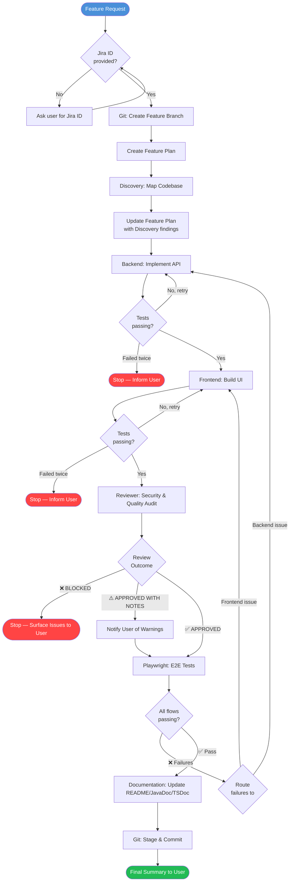

# Orchestrator Agent — Flow Diagram

```mermaid
flowchart TD
    START([Feature Request]) --> JIRA{Jira ID\nprovided?}
    JIRA -- No --> ASK[Ask user for Jira ID]
    ASK --> JIRA
    JIRA -- Yes --> GIT_BRANCH[Git: Create Feature Branch]
    GIT_BRANCH --> PLAN[Create Feature Plan]

    PLAN --> DISCOVERY[Discovery: Map Codebase]
    DISCOVERY --> UPDATE_PLAN[Update Feature Plan\nwith Discovery findings]

    UPDATE_PLAN --> BACKEND[Backend: Implement API]
    BACKEND --> BE_OK{Tests\npassing?}
    BE_OK -- No, retry --> BACKEND
    BE_OK -- Failed twice --> STOP1([Stop — Inform User])
    BE_OK -- Yes --> FRONTEND[Frontend: Build UI]

    FRONTEND --> FE_OK{Tests\npassing?}
    FE_OK -- No, retry --> FRONTEND
    FE_OK -- Failed twice --> STOP2([Stop — Inform User])
    FE_OK -- Yes --> REVIEWER[Reviewer: Security & Quality Audit]

    REVIEWER --> REVIEW_STATUS{Review\nOutcome}
    REVIEW_STATUS -- ❌ BLOCKED --> STOP3([Stop — Surface Issues to User])
    REVIEW_STATUS -- ⚠️ APPROVED WITH NOTES --> NOTIFY[Notify User of Warnings]
    REVIEW_STATUS -- ✅ APPROVED --> PLAYWRIGHT
    NOTIFY --> PLAYWRIGHT[Playwright: E2E Tests]

    PLAYWRIGHT --> E2E_OK{All flows\npassing?}
    E2E_OK -- ❌ Failures --> ROUTE{Route\nfailures to}
    ROUTE -- Backend issue --> BACKEND
    ROUTE -- Frontend issue --> FRONTEND
    E2E_OK -- ✅ Pass --> DOCS[Documentation: Update README/JavaDoc/TSDoc]

    DOCS --> GIT_COMMIT[Git: Stage & Commit]
    GIT_COMMIT --> SUMMARY([Final Summary to User])

    style STOP1 fill:#ff4444,color:#fff
    style STOP2 fill:#ff4444,color:#fff
    style STOP3 fill:#ff4444,color:#fff
    style SUMMARY fill:#22bb55,color:#fff
    style START fill:#4a90d9,color:#fff
```
