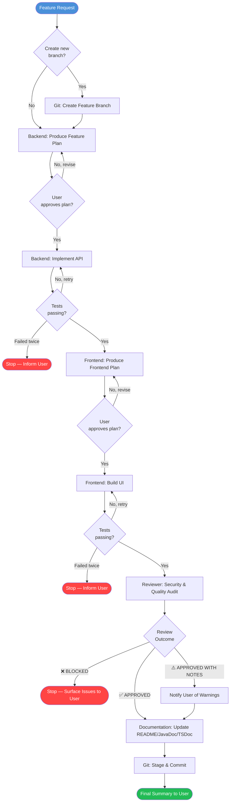

# Orchestrator Agent — Flow Diagram

```mermaid
flowchart TD
    START([Feature Request]) --> BRANCH{Create new\nbranch?}
    BRANCH -- No --> BE_PLAN
    BRANCH -- Yes --> GIT_BRANCH[Git: Create Feature Branch]
    GIT_BRANCH --> BE_PLAN[Backend: Produce Feature Plan]

    BE_PLAN --> BE_PLAN_OK{User\napproves plan?}
    BE_PLAN_OK -- No, revise --> BE_PLAN
    BE_PLAN_OK -- Yes --> BACKEND[Backend: Implement API]

    BACKEND --> BE_OK{Tests\npassing?}
    BE_OK -- No, retry --> BACKEND
    BE_OK -- Failed twice --> STOP1([Stop — Inform User])
    BE_OK -- Yes --> FE_PLAN[Frontend: Produce Frontend Plan]

    FE_PLAN --> FE_PLAN_OK{User\napproves plan?}
    FE_PLAN_OK -- No, revise --> FE_PLAN
    FE_PLAN_OK -- Yes --> FRONTEND[Frontend: Build UI]

    FRONTEND --> FE_OK{Tests\npassing?}
    FE_OK -- No, retry --> FRONTEND
    FE_OK -- Failed twice --> STOP2([Stop — Inform User])
    FE_OK -- Yes --> REVIEWER[Reviewer: Security & Quality Audit]

    REVIEWER --> REVIEW_STATUS{Review\nOutcome}
    REVIEW_STATUS -- ❌ BLOCKED --> STOP3([Stop — Surface Issues to User])
    REVIEW_STATUS -- ⚠️ APPROVED WITH NOTES --> NOTIFY[Notify User of Warnings]
    REVIEW_STATUS -- ✅ APPROVED --> DOCS
    NOTIFY --> DOCS[Documentation: Update README/JavaDoc/TSDoc]

    DOCS --> GIT_COMMIT[Git: Stage & Commit]
    GIT_COMMIT --> SUMMARY([Final Summary to User])

    style STOP1 fill:#ff4444,color:#fff
    style STOP2 fill:#ff4444,color:#fff
    style STOP3 fill:#ff4444,color:#fff
    style SUMMARY fill:#22bb55,color:#fff
    style START fill:#4a90d9,color:#fff
```
